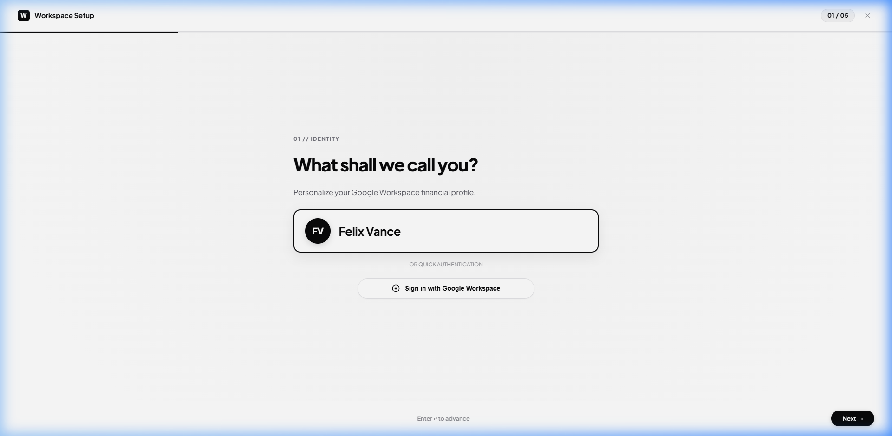
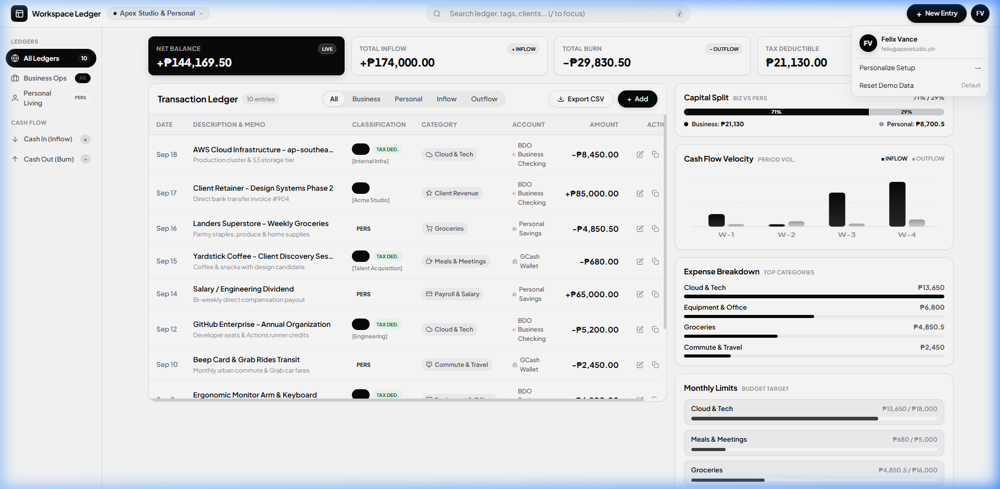

# Vank

[](#)
[](#)
[](#)
[](#)

A browser-based **Expense Planner and Virtual Bank Ledger** designed for professionals, freelancers, and individuals in the Philippines to record, categorize, organize, and monitor cash flow, monthly budgets, and multi-bank financial health with tactile precision.

---

## Interface Preview

### Main Workspace & Virtual Cards Rack

*Spacious iPad & Desktop layout featuring 3D virtual debit cards, real-time metrics, interactive category filters, and dual business/personal ledger.*

---

### Fullscreen Onboarding & Account Personalization

*Smooth animated setup wizard allowing users to configure their workspace profile, opening balance, and starting Philippine bank card from a clean blank slate.*

---

### Account Management & Quick Actions

*Workspace switcher, CSV data export, interactive tutorial guide, and reset options.*

---

## What is this Project? (Is this an Expense Planner?)

> **Yes! This application fits and expands upon the definition of an Expense Planner:**
> 
> *"Expense Planner is a browser-based application designed to help users record, organize, and monitor their daily expenses and budget. Users can enter expense details, categorize their spending, view their expense history, and monitor their total expenses and remaining budget. The application will gradually be developed through HTML, CSS, JavaScript, and later lightweight backend integration."*

### How It Fulfills Every Aspect of the Definition:

| Expense Planner Requirement | Implementation in Workspace Capital Ledger |
|---|---|
| **Browser-Based Application** | Zero-install progressive web application that runs directly in any modern desktop, iPad, tablet, or mobile browser. |
| **Record & Enter Expense Details** | Quick transaction entry (`N` shortcut or `+ Add` button) capturing amount, memo, date, category, virtual bank card, tax-deductibility, and client tags. |
| **Categorize Spending** | Rich category tagging (Cloud & Tech, Client Revenue, Groceries, Meals & Meetings, etc.) paired with clean monochrome SVG iconography. |
| **View Expense History** | Interactive chronological ledger table with inline duplication, editing, permanent deletion, and CSV export. |
| **Monitor Total Expenses & Remaining Budget** | Real-time category budget caps with visual progress tracks (`₱ Spent / ₱ Limit`), over-limit alerts, and instant burn indicators. |
| **Built with HTML, CSS, JavaScript** | Clean Vanilla design system: zero bulky CSS frameworks, pure modular ES6+ JavaScript, and responsive layouts. |
| **Lightweight Backend Ready** | Modular `StateManager` repository architecture (`state.js`) with subscriber events, making integration with SQLite, Express, Supabase, or PocketBase seamless. |

---

## Key Highlights & Features

### 1. Virtual Debit Cards & Philippine Financial Brands
- **Tactile ID-1 Debit Cards (`345px × 215px`)**: Authentically styled debit cards complete with micro-detailed EMV chip, contactless waves, embossed typography, and live balance counters in Philippine Pesos (`₱`).
- **Authentic Philippine Bank Logos**:
  - **Maya / PayMaya** (Neon lime monogram)
  - **GCash** (Bright blue seal with swoosh)
  - **BDO Unibank** (Signature navy & gold seal)
  - **BPI** (Deep crimson red seal)
  - **UnionBank** (Vibrant orange geometric star)
  - **GoTyme Bank** (Modern turquoise-cyan mark)
  - **Metrobank**, **RCBC**, **SeaBank**, and **Generic Digital Bank**.
- **Active Card Outline & Dimming**: Clicking any card highlights it with a high-contrast double ring outline (`outline: 3px solid #000; box-shadow: 0 0 0 2.5px #fff, 0 0 0 6px #000;`) and an animated `● ACTIVE` badge, while dimming inactive cards for focus.
- **Whole Card / All Cards View**: A toggle pill (`#btn-all-cards-view`) allows switching between individual card focus and consolidated multi-card overview.
- **Card Removal**: Discreet frosted glass `✕` button on hover to remove virtual banks (with confirmation safeguard to keep at least 1 card).

### 2. Accurate Live Balance Calculation
- Automated transaction reconciliation avoids double-counting opening liquidity buffers.
- Dynamic balance tracking across income deposits, business expenses, and personal spending.

### 3. Monthly Category Budgets & Burn Limits
- Custom budget manager allowing users to establish monthly spending caps per category.
- Real-time spend vs limit progress tracks (`₱ Spent / ₱ Limit`) with over-limit warnings.
- One-click deletion trigger (`✕`) on budget cards to recalibrate limits anytime.

### 4. iPad & Desktop Sizing (Mouse & Touch Ergonomics)
- **Top Header (`64px`)**: Clean brand mark, workspace switcher with full name display, and quick search.
- **Navigation Rail (`265px`)**: Roomy sidebar with smooth text ellipsis, balance badges, and zero horizontal overflow.
- **Interactive Filtering**: Clicking any category chip in the ledger, category breakdown chart, or budget cards filters the workspace instantly.
- **Clearable Filter Chips**: Search bar displays active filter pills with a `✕` dismiss button.

### 5. Native Mobile Web App Experience
- Full-width slide-up mobile menu sheet (`#mobile-app-menu-sheet`) with user profile card, 3-way workspace selector, and swipeable virtual bank shelf.
- Elevated circular floating action button (`52px`) on the bottom dock for rapid expense logging on mobile.

### 6. Interactive Typewriter Tutorial Guide
- Top banner with typewriter text animation walking users through virtual cards, quick entry, budgets, and smart filters.
- Carousel navigation (`‹ 1/5 ›`) with direct action links and one-click dismissal.

---

## Project Structure

```
ExpenseTracker/
├── index.html                   # Semantic HTML5 Application Shell
├── package.json                 # Build Scripts & Vite Configuration
├── vite.config.js               # Fast Local Development Server Config
├── run.bat                      # Windows One-Click Launch Script
├── docs/
│   └── images/                  # Architecture & UI Screenshots
└── src/
    ├── scripts/
    │   ├── app.js               # Central App Controller & Event Loop
    │   ├── state.js             # State Manager, Balances & Calculations
    │   ├── workspace.js         # Workspace Navigation, Rail & Virtual Cards
    │   ├── ledger.js            # Transaction Table Rendering & Row Actions
    │   ├── charts.js            # Cash Flow SVG Charts & Budget Bars
    │   ├── modal.js             # Add/Edit Transaction Modal
    │   ├── budgetModal.js       # Set Category Budget Modal
    │   ├── bankModal.js         # Add Virtual Bank Modal
    │   ├── bankLogos.js         # Philippine Bank SVG Logos & Colorways
    │   ├── onboarding.js        # Fullscreen Setup Wizard
    │   └── tutorial.js          # Interactive Animated Guide Banner
    └── styles/
        ├── base.css             # Typography Tokens & Theme Variables
        ├── workspace.css        # Header, Nav Rail & Responsive Grid
        ├── cards.css            # Virtual Debit Cards & Radiant Gradients
        ├── ledger.css           # Table Typography & Action Buttons
        ├── charts.css           # SVG Cash Flow & Budget Cards
        ├── modal.css            # Action Dialogs & Input Controls
        └── onboarding.css       # Fullscreen Wizard Animations
```

---

## Keyboard Shortcuts

| Key | Action |
|---|---|
| <kbd>N</kbd> | Open New Transaction modal |
| <kbd>/</kbd> | Focus global search input |
| <kbd>Esc</kbd> | Close active modal, popover, or sheet |

---

## Getting Started

### Prerequisites
- [Node.js](https://nodejs.org/) (version 18 or newer recommended)
- `npm` package manager

### Installation & Local Run
```bash
# 1. Clone repository
git clone https://github.com/Neon-Felix/ExpenseTracker.git
cd ExpenseTracker

# 2. Install dependencies
npm install

# 3. Start local development server
npm run dev
```

Visit `http://localhost:5173/` in your browser.

### Windows Shortcut
Double-click `run.bat` to launch the dev server automatically.

### Production Build
```bash
npm run build
```
Generates a static production bundle in `dist/`.

---

## Future Roadmap (Backend Integration)

- [x] Full in-browser state persistence via `localStorage`
- [x] Multi-card virtual banking & Philippine financial institution branding
- [x] Category budget caps & real-time burn tracking
- [ ] SQLite / PocketBase local database adapter
- [ ] Multi-currency support with live exchange rates
- [ ] Biometric authentication for PWA mobile installs
