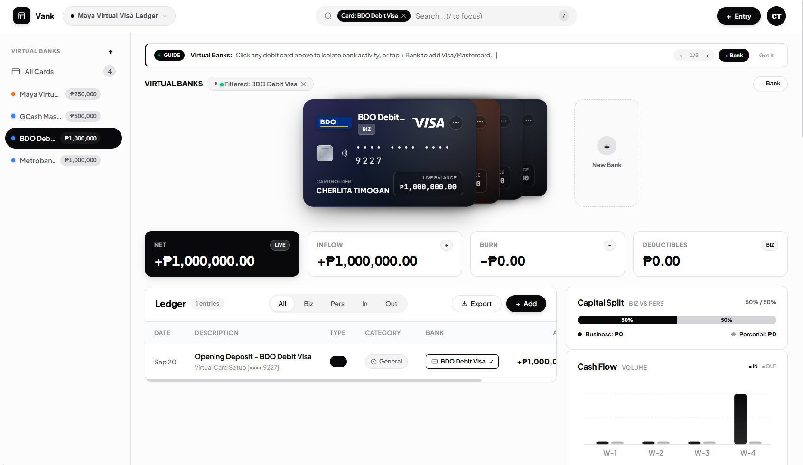

# Vank

## Try it now here! 
https://chedt.github.io/Vank/

[](#)
[](#)
[](#)
[](#)

---

## Interface Preview

### Main Workspace & Virtual Cards Rack


---

## Project Structure

```
ExpenseTracker/
├── index.html                   # Semantic HTML5 Application Shell
├── package.json                 # Build Scripts & Vite Configuration
├── vite.config.js               # Fast Local Development Server Config
├── run.bat                      # Windows One-Click Launch Script
├── docs/
│   └── images/                  # Architecture & UI Screenshots
└── src/
    ├── scripts/
    │   ├── app.js               # Central App Controller & Event Loop
    │   ├── state.js             # State Manager, Balances & Calculations
    │   ├── workspace.js         # Workspace Navigation, Rail & Virtual Cards
    │   ├── ledger.js            # Transaction Table Rendering & Row Actions
    │   ├── charts.js            # Cash Flow SVG Charts & Budget Bars
    │   ├── modal.js             # Add/Edit Transaction Modal
    │   ├── budgetModal.js       # Set Category Budget Modal
    │   ├── bankModal.js         # Add Virtual Bank Modal
    │   ├── bankLogos.js         # Philippine Bank SVG Logos & Colorways
    │   ├── onboarding.js        # Fullscreen Setup Wizard
    │   └── tutorial.js          # Interactive Animated Guide Banner
    └── styles/
        ├── base.css             # Typography Tokens & Theme Variables
        ├── workspace.css        # Header, Nav Rail & Responsive Grid
        ├── cards.css            # Virtual Debit Cards & Radiant Gradients
        ├── ledger.css           # Table Typography & Action Buttons
        ├── charts.css           # SVG Cash Flow & Budget Cards
        ├── modal.css            # Action Dialogs & Input Controls
        └── onboarding.css       # Fullscreen Wizard Animations
```
---

## Getting Started

### Prerequisites
- [Node.js](https://nodejs.org/) (version 18 or newer recommended)
- `npm` package manager

### Installation & Local Run
```bash
# 1. Clone repository
git clone https://github.com/Neon-Felix/ExpenseTracker.git
cd ExpenseTracker

# 2. Install dependencies
npm install

# 3. Start local development server
npm run dev
```

Visit `http://localhost:5173/` in your browser.

### Windows Shortcut
Double-click `run.bat` to launch the dev server automatically.

### Production Build
```bash
npm run build
```
Generates a static production bundle in `dist/`.

---

## Future Roadmap (Backend Integration)

- [x] Full in-browser state persistence via `localStorage`
- [x] Multi-card virtual banking & Philippine financial institution branding
- [x] Category budget caps & real-time burn tracking
- [ ] SQLite / PocketBase local database adapter
- [ ] Multi-currency support with live exchange rates
- [ ] Biometric authentication for PWA mobile installs
