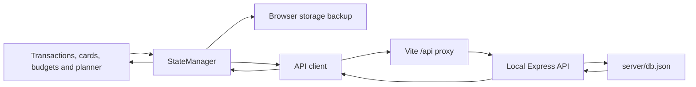

# Vank integration

## Scope

This integrates the local backend introduced in PR #1 with the frontend test foundation from PR #2 and the redesigned Overview, Banks, Ledger and Planning pages. It adds reliable test isolation, checks actual backend persistence, fixes the test runner errors, and supplies repeatable startup and review steps. A separate checkout on `codex/final-integration` holds the integration work; the GitHub pull request has not been merged or updated by these local edits.

Overview is the default page. Banks contains the animated card stack and card management. Ledger contains transactions, filters, spending breakdown and budgets. Planning contains targets, recurring bills and goals. Desktop rail and mobile dock navigation use URL hashes, including refresh and browser history.

The completed redesign is summarized in [CHANGES.md](CHANGES.md), with its visual decisions in [UI_DESIGN.md](UI_DESIGN.md). `WorkspaceController` manages routes, cards and navigation; `app.js` wires the form, ledger and planning controllers after loading state.

## Components and data flow



1. `src/scripts/app.js` waits for `state.ready` before initializing the interface.
2. `StateManager` loads `GET /api/state`. Server state wins when available.
3. Transactions, budgets, cards, and planner actions update the in-memory workspace and calculations.
4. Every save captures a complete, independent snapshot and immediately caches it in browser storage.
5. Snapshots are sent to the backend in edit order. `pendingSave` resolves when the current save queue has finished; use it in tests instead of leaving requests running after teardown.
6. The backend validates the top-level state shape and writes a temporary file before replacing the database file.
7. A missing database yields an empty workspace. Invalid existing JSON returns an error and is preserved rather than silently reset.

The browser currently persists through **full-state GET/POST**, even though resource-specific API routes are also available. These routes are tested separately; individual frontend actions do not call each resource route directly.

## Storage and fallback

| Location | What it stores | Git behavior |
| --- | --- | --- |
| `server/db.json` | Local workspace data | Ignored; existing file preserved locally |
| Browser `localStorage` | Latest cached workspace snapshot | Specific to the browser and frontend origin |
| `test-results/backend/db.json` | Browser test workspace | Ignored; tests reseed it |
| Temporary operating-system directory | API test databases | Created per test and removed afterward |

The browser storage key is `gworkspace_tracker_state_v4_virtual_banks`, retained for compatibility with existing data.

If the API cannot load state, the app attempts browser storage and then starts a fresh profile. Failed writes retain the browser snapshot. API requests have a five-second timeout. If browser storage is blocked but the backend works, backend saving can still proceed.

`StateManager.connectionStatus` tracks loading, connected and offline status. The interface displays an offline message with Retry when state cannot reach the API. Retry reloads the page and repeats the normal load; it does not merge offline edits into backend data.

**Offline data is not automatically merged with server data.** When the backend is reachable on a subsequent page load, its workspace takes precedence. Export important offline transactions before switching back to the backend. Different origins such as `localhost:5173` and `127.0.0.1:5173` have different browser storage; use one address consistently.

## Configuration and commands

| Setting | Default | Use |
| --- | --- | --- |
| `PORT` | `3001` | Backend port; Vite uses the same value as its proxy target |
| `VANK_DB_FILE` | `server/db.json` | Alternate local database file |
| `VITE_API_BASE_URL` | `/api` | Optional API URL, baked into the frontend at build time |
| `VANK_FRONTEND_PORT` | `5173` | Frontend port; an occupied port fails rather than silently using another |
| `VANK_TEST_FRONTEND_PORT` | `4317` | Browser test frontend port when testing concurrent checkouts |
| `VANK_TEST_BACKEND_PORT` | `4318` | Browser test API port; uses its isolated test database |

To use an alternate database in PowerShell:

```powershell
$env:VANK_DB_FILE = 'C:\VankData\workspace.json'
npm start
```

To use another API port for both services:

```powershell
$env:PORT = '3005'
npm start
```

If another Vank session is already running, give this checkout its own frontend port too:

```powershell
$env:PORT = '3005'
$env:VANK_FRONTEND_PORT = '5174'
npm start
```

Open http://127.0.0.1:5174 for that session. The Windows shortcut opens the default port; use a terminal for custom ports.

These variables affect the current terminal. Close it or remove the variables to restore defaults. Keep custom database files outside the repository, or add their paths to `.gitignore`.

### Production frontend preview

```powershell
npm run build
```

In one terminal run `npm run server`; in a second run `npm run preview`. Open the address Vite prints (normally http://127.0.0.1:4173). Preview also proxies `/api` to the local backend. `dist/` is generated output and is not committed.

A static host such as GitHub Pages cannot run the Express backend. The static frontend may use browser storage when `/api` is unavailable. A complete hosted deployment needs a backend and a matching API/proxy configuration; this integration does not deploy one.

## API reference

All routes below use the `/api` prefix and JSON request/response bodies. Successful creates return `201`; updates to unknown transaction/card/plan IDs return `404`. Deletes are idempotent.

| Resource | Routes |
| --- | --- |
| Full workspace | `GET /state`, `POST /state` |
| Transactions | `GET /transactions`, `POST /transactions`, `PUT /transactions/:id`, `DELETE /transactions/:id` |
| Virtual banks | `GET /banks`, `POST /banks`, `PUT /banks/:id`, `DELETE /banks/:id` |
| Budgets | `GET /budgets`, `POST /budgets`, `DELETE /budgets/:category` |
| Profile | `GET /profile`, `PUT /profile` |
| Planner settings | `PUT /planner/settings` |
| Recurring plans | `POST /planner/recurring`, `PUT /planner/recurring/:id`, `DELETE /planner/recurring/:id` |
| Goals | `POST /planner/goals`, `PUT /planner/goals/:id`, `DELETE /planner/goals/:id` |

`POST /state` replaces the complete workspace, filling in missing top-level collections with empty defaults. Invalid collection shapes return `400` without replacing the database. Budget creation updates an existing category case-insensitively. Category names in delete URLs must be URL-encoded. Profile and planner settings updates merge provided fields.

## Release boundaries

This is a **single-user, local application**. The API listens on loopback and has no login or authorization. Full-state writes do not provide conflict resolution across simultaneous browsers or multiple API processes. Resource routes have basic behavior checks but do not implement comprehensive financial-record validation. The integration has no cloud database, bank connection, live exchange rates, or automatic offline reconciliation.

Stop the app before copying `server/db.json` for a backup. To recover a corrupt database, keep a copy of the damaged file and restore a known-good JSON backup before restarting the app. Tests use their own databases and do not reset your local workspace.
